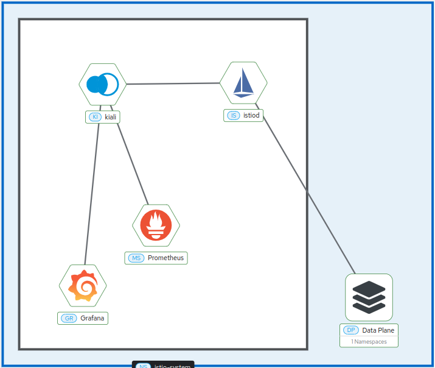

# Hip, Ho!

## Configure Environment

The assembled architecture depends on some tools for operation, which are:

- Minikube (k8s)
- Istio and Kiali
- Prometheus
- Jaeger
- Grafana

Below is a step-by-step guide for configuring each one.

### 1. Install minikube

In In the official minkube documentation with istio it is recommended that minikube be started with the following configuration. [[Documnetation](https://minikube.sigs.k8s.io/docs/handbook/addons/istio/)]

```
$ minikube start --memory=8192mb --cpus=4
```

```
output
---
😄  minikube v1.33.1 on Arch 
✨  Automatically selected the docker driver. Other choices: virtualbox, ssh
📌  Using Docker driver with root privileges
👍  Starting "minikube" primary control-plane node in "minikube" cluster
🚜  Pulling base image v0.0.44 ...
💾  Downloading Kubernetes v1.30.0 preload ...
    > preloaded-images-k8s-v18-v1...:  342.90 MiB / 342.90 MiB  100.00% 8.78 Mi
    > gcr.io/k8s-minikube/kicbase...:  481.58 MiB / 481.58 MiB  100.00% 7.61 Mi
🔥  Creating docker container (CPUs=4, Memory=8192MB) ...
🐳  Preparing Kubernetes v1.30.0 on Docker 26.1.1 ...
    ▪ Generating certificates and keys ...
    ▪ Booting up control plane ...
    ▪ Configuring RBAC rules ...
🔗  Configuring bridge CNI (Container Networking Interface) ...
🔎  Verifying Kubernetes components...
    ▪ Using image gcr.io/k8s-minikube/storage-provisioner:v5
🌟  Enabled addons: storage-provisioner, default-storageclass
🏄  Done! kubectl is now configured to use "minikube" cluster and "default" namespace by default
```

### 2. Install Istio and Kiali

Install istio according to the official configuration and then initialize istio in the kubernetes cluster using the CDR, using the command below. [[doc](https://istio.io/latest/docs/setup/getting-started/#download)]

```
$ istioctl manifest generate | kubectl apply -f -
```

To configure Kiali, use:

```
kubectl apply -f https://raw.githubusercontent.com/istio/istio/release-1.23/samples/addons/kiali.yaml
```

### 3. Prometheus to Kiali

The official istio documentation shows how to configure Prometheus with istio. [[Doc](https://istio.io/latest/docs/ops/integrations/prometheus/)]

```
$ kubectl apply -f https://raw.githubusercontent.com/istio/istio/release-1.23/samples/addons/prometheus.yaml
```

### 4. Jaeger to Kiali

The official istio documentation shows how to configure Jaeger with istio in a simple and direct way. [[Doc](https://istio.io/latest/docs/ops/integrations/jaeger/#installation)]

```
$ kubectl apply -f https://raw.githubusercontent.com/istio/istio/release-1.23/samples/addons/jaeger.yaml
```

### 5. Grafana to Kiali

In the official istio documentation, installation for testing is indicated as follows. [[Doc](https://istio.io/latest/docs/ops/integrations/grafana/)]

```
kubectl apply -f https://raw.githubusercontent.com/istio/istio/release-1.23/samples/addons/grafana.yaml
```

After all the tools are installed, you can access Kiali and check that all settings have been made correctly.

```
$ kubectl port-forward svc/kiali 20001:20001 -n istio-system
```

